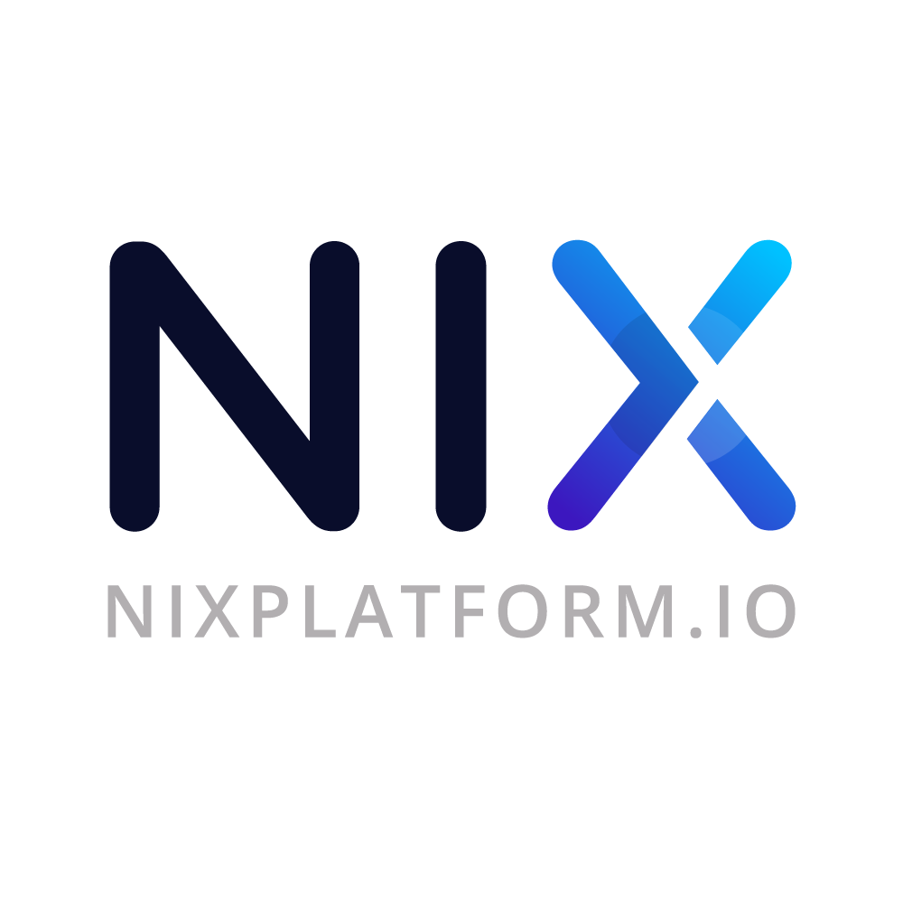

    

### What is NIX?
---

NIX is a digital currency that combines Atomic Swaps/Smart Contracts and privacy using our unique, innovative Ghost Protocol to provide the world with a truly anonymous and decentralized transfer of assets for the cross-chain era

### Key Features
---

* NIX utilizes a custom built privacy library that integrates Zerocoin/Stealthoutputs/Bulletproofs and TOR support. This allows transaction privacy in its fullest and most trustless form.

* NIX aims to create a privatized DEX platform built on top of already developed DEX volumes to conduct privatized atomic swaps through use of NIX’s privacy library.

* Ghost Protocol and Ghost Vault to enhance privacy features.

For more information, please visit [NixPlatform.io](https://nixplatform.io/nixplatform.io) or read the [whitepaper](https://nixplatform.io/docs/NIX-Platform-Whitepaper.pdf).

### Guides & Documentation

* [White Paper](https://nixplatform.io/docs/NIX-Platform-Whitepaper.pdf)
* [NIX Ghost Nodes](https://nixplatform.zendesk.com/hc/en-us/articles/360005044571-Setting-up-your-Ghost-Node)

### Links & Resources
---

* [NIX Website](https://nixplatform.io)
* [Discord Chat](https://chat.nixplatform.io/)
* [Reddit](https://reddit.com/r/nixplatform)
* [Medium](https://medium.com/@nixplatform)
* [Twitter](https://twitter.com/nixplatform)
* [GitHub wiki](https://github.com/nixplatform/nixcore/wiki)

License
---

NIX Core is released under the terms of the MIT license. See [COPYING](COPYING) for more
information or see https://opensource.org/licenses/MIT.

Copyright (c) 2017-2018 The NIX Core Developers Copyright (c) 2013-2015 The Bitcoin Core Developers
